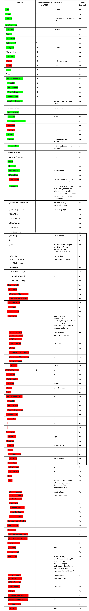
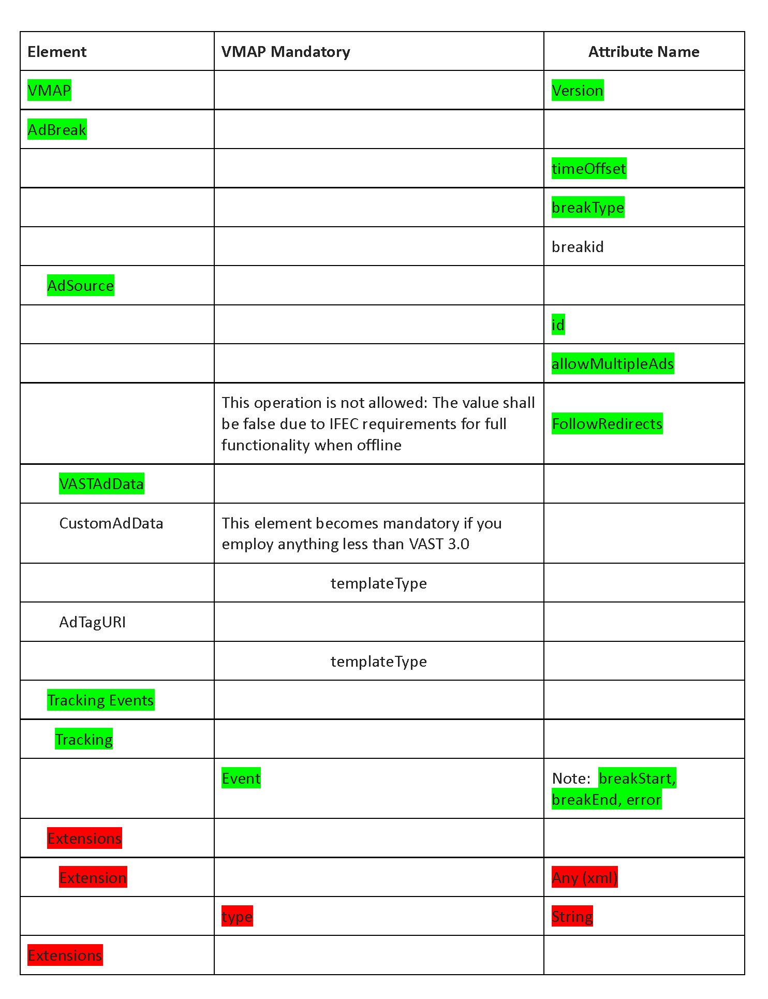

# APEX-0918-Unified-Core-Reporting-Schema
### Disclaimer:  
The introductory clause is strictly informative. 

## Introduction 
This advertising impression reporting schema specification is intended to facilitate the acceptance, recognition and accreditation of the unique media currency provided by airline publishers of streaming entertainment. It may also have applicability to other advertising workflows within the transportation sector.
The normative clauses of this document define a concise and slightly constrained subset of the VAST 4.0 and VMAP 1.0.1 elements and attributes. This subset is classified based on functionality that is core to the onboard experience. Every enumerated element and attribute shall be allowed in IFE servers, clients and back-end reporting systems. It is anticipated that commercial schema validiation practices will emerge from specific use cases that take advantage of the clasifications established within this concensus document.  

Please refer to the Appendix for further background information and for insights into the context of this unification effort.

## Terms and Definitions  
**Ad-ID:**
marketplace mandated voluntary web-based system for the registration of advertising assets <http://www.ad-id.org/about/mandate>

**DSP**
demand-side platform allowing buyers of digital advertising inventory to manage multiple accounts  

**EIDR:**
system for unique universal registration of movie and television assets <https://eidr.org/>  

**OMID:**
open measurement interface definition supported by a software development kit published by the IAB Technology Laboratory <https://iabtechlab.com/standards/open-measurement-sdk/>  

**VAST:**
video ad serving XML template standardized by the Interactive Advertising Bureau <https://iabtechlab.com/standards/vast/>  

**VMAP:**
XML template that can be used within VAST to provide playlist functionality for multiple ads <https://www.iab.com/guidelines/digital-video-multiple-ad-playlist-vmap-1-0-1/>

## Unified Core Reporting Schema
The following two tables define a concise and slightly constrained subset of the VAST 4.0 elements and attributes and the VMAP 1.0.1 elements and attributes respectively.  

**Optional:** 
items not highlighted—applicability depends on use case  
Elements and attributes that are not necessarily required and may be ignored

**Mandatory:** 
items highlighted in green  
Elements and attributes that are generally required in audience impression reports  

**Optional and Not Recommended:** 
items highlighted in red  
Elements and attributes that are generally considered unnecessary and wasteful of limited IFEC resources  

<figure>
	
	<figcaption>Table 1: Core VAST Elements</figcaption>
</figure>
<figure>
	
	<figcaption>Table 2: VMAP Extensions</figcaption>
</figure>  

## Appendix A: Market Considerations  

Mainstream marketing is changing rapidly. Projections for the flow of North American ad spending tell us that the mass audience is moving away from broadcast and cable television. Internet display advertising, electronic bulk mail, search engine advertising and over the top streaming services have eroded the broadcaster’s traditional ad-supported ecosystem. The global advertising industry is responding to these challenging audience distractions with innovative marketing tools. By way of this specification and other outreach efforts, APEX is proactively embracing their cutting-edge resources.  

Some of these trusted platforms enable automation through voluntary coordination. The continuing efforts of two non-profit bodies, the Entertainment Identifier Registry (EIDR) and Ad-ID.org, ensure that all professional content has or will soon have a unique, constantly available, identification number. The boards of directors of both the Association of National Advertisers (ANA) and the American Association of Advertising Agencies (4A's) have unanimously endorsed Advertising Digital Identification, LLC (Ad-ID) as the industry standard for web-based universal coding of all advertising assets.  

*Mobile out-of-home and digital place-based*
marketing strategies are evolving rapidly. The added value of IFEC springs from the fact that airlines maintain a relatively distraction-free environment. At a time when traditional audience impression resources are becoming scarce, our captive audience can mint a unique media currency.  

Global ad delivery ordering and fulfillment workflows have become increasingly automated. This expanding ecosystem already incorporates adaptive self-learning networks that improve ROI by delivering contextualized, personalized and targeted messages. We are not witnessing the proverbial conflict of man versus machine; we are participants in the maturation of an essential cultural phenomenon. Human assisted rules-based marketplace management resources have recently achieved the level of sophistication needed to serve as workmanlike tools. Publishers can deploy systems that capture geography, timeframe, weather and content adjacency. These and other analytic resources can give airline management executives aggregate reports that reflect the context of each audience impression.  

To minimize advertising clutter by limiting the number of commercial breaks and controlling the number of ads within each break, IFEC publishers need to command the highest possible cost per thousand impression (CPM) rates. The proven way to accomplish this is to present advertisers with a unified marketplace offering our distinct media currency. In a world where ad fraud is a major concern, it’s not enough to offer targeted, trackable and verifiable audience impressions. It’s time for our industry to proactively adapt for its own use the standardized reporting platforms that the independent oversight authorities prefer.  

## Appendix B: Essential Advertising Workflow Functions  

Modern ad-supported publishing operations deserve the support of well-known DSP marketplace aggregators because they can automatically capture orders for advertising inventory. These orders will be continuously filled by ad-supported onboard entertainment systems. To help monetize every commercial message that is delivered on board, the APEX ADWG is articulating a unified core for reporting each audience impression (see Table 1 and Table 2). This unification, which is formed around the Interactive Advertising Bureau’s digital video ad serving template, implies general use of the bureau’s open measurement SDK (OMID). The third-party independent servers aggregating numerous IFEC-certified OMID impressions will doubtlessly maintain their accreditation via annual audits. This ongoing oversight will be moderated by well-known authorities such as Kantar Media, comScore, and/or the Media Rating Council.  

This trusted system must report the entire ad block as well as the adjacent show(s) for each targeted impression. It must deliver all that detail while also honoring passenger privacy, advertiser confidentiality, and airline control. To achieve this, IFEC platforms should offer the airline a significant degree of insight into the ad sales performance and targeting efficiency. Authorized access structures such as these can be maintained through the aggregation of (properly pseudonymized) content type consumption trends and core viewership patterns. At a minimum, this privileged impression data can be grouped by flight origin and destination, date and time, ticket price class, timing of advance ticket purchase, etc.  

## Appendix C: Implementation Parameters  

Ad placement mechanisms should be treated as independent and dynamic blocks even when their functional implementations seem to be intertwined with other systems. Ad-supported entertainment platforms may employ broadband air-to-ground connectivity systems and may (partially) rely on cloud-based streaming infrastructures. Or, new IFEC solutions can more closely resemble legacy designs. Fully offline solutions can incorporate streaming servers that instantiate proxy servers that stitch commercial messages into each passenger’s DASH manifest. Alternately, an onboard IFEC ad placement mechanism can consist of nothing more than a conventional HTML server. An airline can populate its passenger’s browser pages with (rich video) advertisement banners. In every case, to elevate the PAX experience as well as maximize airline revenue, the effectiveness of the core ad placement block needs to be scrutinized, optimized and thoughtfully monetized. This is an ongoing obligation that calls for a merger of the latest machine learning technologies with thoughtful marketing skills.  

*Trust and verify*
is the mantra of modern IT security design. Secrecy is not an acceptable substitute for trust. In the realm of ad-supported entertainment, trust cannot exist without the protection of rigorous verification protocols. Note that any workflow involving audience-impression records must preserve an audit trail.  

In the spirit of trustworthy and open standardization, all new IFEC workflows must use Ad-ID and EIDR. These non-profit registration authorities have active industry support. The identifiers they issue deserve to take precedence even when the use of established house numbers and media asset management platforms seems more familiar and efficient.  

When architecting Wi-Fi bandwidth management solutions, give recognized practices first consideration. QoS reports based on open industry standards can remain meaningful outside the realm of IFEC technology. These well known practices include MPEG SAND <https://dash-industry-forum.github.io/docs/CR-SAND-DASH-IF-IOP_Community-Review.pdf> and related CTA and SVA standards <http://www.streamingvideoalliance.org/download/4482/>.  

## Appendix D: Conformance Resources  

Initial validation of any sample VAST 4.0 XML is relatively straightforward. The IAB Lab maintains a VAST 4.0 XSD string/file at this GitHub repository <https://github.com/InteractiveAdvertisingBureau/vast>. A convenient interactive online validation tool can be accessed at this web site <https://vastvalidator.iabtechlab.com/dash> (registration required).  

The utility of this document and the express intentions of its contributors spring from our constraints and prioritizations of the set of VAST and VMPA elements and attributes we have normatively referenced. Common sense industrial engineering principles dictate that practical conformance exercises ought to focus on the specific elements and attributes categorized as mandatory by this unified reporting schema. 

Input from accross the industry will continue to inform ongoing plans to contribute to the IAB VAST Tag Validator GitHub project.  

## Bibliography (Informative)  
**CMAF:**
common media application format—MPEG Standard 23000-19 <https://mpeg.chiariglione.org/standards/mpeg-a/common-media-application-format>  

**DASH-IF:**
streaming technology industry forum—developer and publisher of comprehensive interoperability points that encompass targeted ad-insertions through the use of MPEG-DASH periods <https://dashif.org/about/>

**DASH emsg:**
W3C triggers for timed media events <https://w3c.github.io/me-media-timed-events/>  

**ESAM**
cableLabs real-time event signaling and management API and schema <http://mibs.cablelabs.com/namespaces/opencable/xsd/esam/OC-SP-ESAM-API-C01-Signal.xsd>  

**Interoperable Master Format—Composition Playlist:**
SMPTE standard for content masters containing a MarkerResourceType schema encompassing MarkerType definitions for commercial blacks <https://ieeexplore.ieee.org/document/7560854>  

**Minimum Standards for Media Rating Research:**
disclosure and delivery conditions for industry mandated, self-regulatory ad impression accreditation—published by the Media Rating Council <http://www.mediaratingcouncil.org/MRC%20Standards.htm>

**MXF Ad-ID Digital Ad Slate:**
industry practice for associating the Advertising Digital Identifier (Ad-ID) and other machine-readable metadata items with content <https://amwa.tv/projects/AS-12.shtml>  

**OBID:**
SMPTE standards suite covering the open binding of specific content and distribution channel identifiers to audiovisual content <https://doi.org/10.5594/SMPTE.OV2112-0.2018>  

**OpenRTB:**
API specification supporting the automation of real-time ad impression bidding platforms <https://www.iab.com/guidelines/real-time-bidding-rtb-project/> 

**SAND:**
acronym for server and network assisted DASH—when used in conjunction with a companion streaming server specification called DANE, this ISO/IEC 23009-5 Standard enables quality of experience optimization, measurement, and reporting <http://tnomedialab.github.io/sand/>

**SCTE 35:**
core signaling standard for controlling advertisements within cable TV content <www.scte.org/SCTEDocs/Standards/SCTE%2035%202016.pdf>  

**SCTE 104:**
communications API covering SCTE 35 private sections, including the time_descriptor commands that convey wall clock time to a client <https://www.scte.org/SCTEDocs/Standards/SCTE%20104%202018r2.pdf>  

**SCTE 224:**
two-way event scheduling and notification interface enabling schemas that establish elements defining Audience Types <https://www.scte.org/SCTEDocs/Standards/ANSI_SCTE%20224%202018r1.pdf>  

